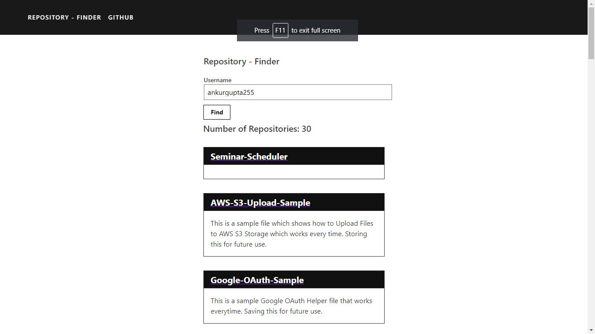

# Github Repository Finder

This is a simple Github Repository Finder made using the Github API made using React.

You can access the application at: https://boiling-bayou-11617.herokuapp.com/

To run this application:

- Firstly Clone the Repository.

- Create a .env file in the Repository Folder and add the following variables.

```
REACT_APP_CLIENT_ID=<your_client_id>
REACT_APP_CLIENT_SECRET=<your_client_secret>
```

- Then run the following commands.

```
cd repo
npm install
npm start
```

# Screenshot


